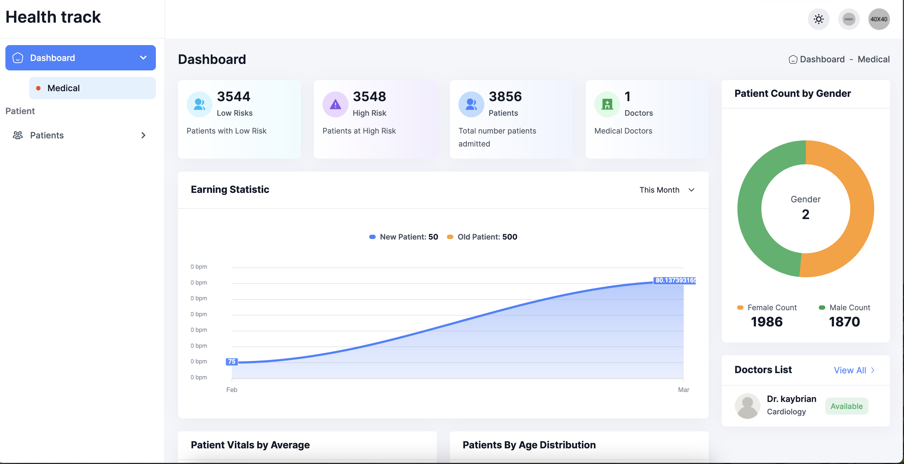

# HealthTrack Pro - Medical Monitoring Dashboard


*Real-time patient monitoring system with AI-powered insights*

## 🌟 System Overview
A Django-based medical dashboard that aggregates data from IoT health devices, providing clinicians with:
- Real-time patient vitals monitoring
- AI-powered risk prediction analytics
- Historical health trend visualization
- Multi-user access control for medical teams

## 🛠 Tech Stack
**Backend**  
- Django
- Python

**Frontend**  
- Bootstrap
- Chart.js

**Database**  
- SQLite 

##  Key Features

### Patient Analytics Dashboard
- Real-time vital sign visualization (BP/HR trends)
- Risk probability heatmaps
- Age/gender distribution charts
- High-risk patient filtering (Top 5 shown by default)

### Medical Team Features
| Feature | Description |
|---------|-------------|
|  Doctor Management | CRUD operations for medical staff |
|  Patient Profiles | Detailed medical histories |
|  Alert System | Threshold-based notifications |
| Trend Analysis | 7-day health parameter tracking |

### Admin Capabilities
```python
# Sample Admin Model
class PatientAdmin(admin.ModelAdmin):
    list_display = ('name', 'patient_id', 'last_bp', 'risk_score')
    search_fields = ['name', 'patient_id']
    list_filter = ('risk_category', 'age_group')
```

##  Installation Guide

1. **Clone Repository**
```bash
git clone https://github.com/kaybrian/captsone_server
cd captsone_server
```

2. **Install Dependencies**
```bash
pip install -r requirements.txt
```

3. **Database Setup**
```bash
python manage.py migrate
python manage.py createsuperuser
```

4. **Configure Device API**


5. **Run Server**
```bash
python manage.py runserver
```

## Project Structure
```
healthtrack-pro/
├── HealthData/               # Core application
│   ├── settings.py           # project settings 
│   ├── asgi.py/                 
│   └── urls.py               # all the urls for the project settings
├── templates/                # Dashboard UI
├── static/                   # CSS/JS assets
├── users/                    # Authentication system
└── manage.py                 # Django CLI
```

##  Device API Endpoints

| Endpoint | Method | Description |
|----------|--------|-------------|
| `/api/patients/` | GET | Retrieve a list of all patients. |
| `/api/patients/create/` | POST | Create a new patient record. |
| `/api/patients/heart-rate-by-month/` | GET | get a list of heart rate data grouped by month  |


## Sample Dashboard Metrics

**Patient Statistics**
```text
Total Patients: 3856
High Risk Patients: 3544 (91.8%)
Current Alerts: 12
```

**Vital Averages**
| Metric | Average | Threshold |
|--------|---------|-----------|
| Blood Pressure | 135.43% | 140% |
| Heart Rate | 80.13 bpm | 100 bpm |
| Risk Score | 42.8% | 60% |

##  Future Roadmap
- Add multi-hospital support
- Implement HIPAA-compliant audit logging
- Develop mobile clinician app
- Integrate prescription management
- Add telemedicine capabilities


**Medical Device Integration Guide Available in `/redoc`**
```

This README provides:
1. Clear setup instructions for both developers and medical IT staff
2. API documentation for device integration
3. Security considerations for healthcare data
4. Visual representations of key dashboard features
5. Scalability path for future enhancements
```